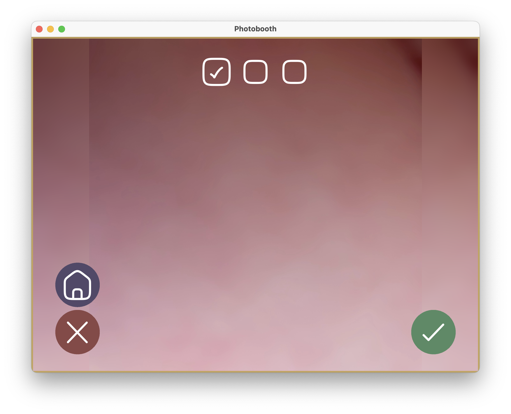

# Simple PhotoBooth

A simple and intuitive photobooth application designed to be easy to use, even for young children (tested with 3-5 year olds). This project provides a straightforward photo-taking experience without unnecessary complexity.

## Features

- **Multiple Camera Support:** Compatible with Raspberry Pi Camera Module 3, DSLR cameras (via gPhoto2), and USB webcams
- **Intelligent Camera Selection:** Automatically uses the best available camera (DSLR for capture, Pi Camera for preview)
- **Direct Printing:** Support for DNP DS620 and other CUPS-compatible printers
- **LED Ring Effects:** Visual feedback with WS2812 LED ring support
- **USB Photo Export:** Automatic photo dump to USB drives
- **Multiple Photo Formats:** Support for different collage layouts
- **Touch Screen Interface:** Optimized for 7" Ingcool touchscreen and above
- **WiFi Sharing:** Share photos via WiFi network (QR code generation)

## Screenshots




## Screen Flow

The photobooth application follows this screen navigation flow:

```
                        ┌─────────────┐
                  ┌────►│   Waiting   │◄────────────────┐
                  │     │   Screen    │                 │
                  │     └──────┬──────┘                 │
                  │            │ Touch                  │
                  │            ▼                        │
                  │     ┌─────────────┐                 │
                  │     │   Select    │                 │
                  │     │   Format    │                 │
                  │     └──────┬──────┘                 │
                  │            │ Choose                 │
                  │            ▼                        │
                  │     ┌─────────────┐                 │
           ┌──────┴────►│  Countdown  │                 │
           │            │   Screen    │                 │
           │            └──────┬──────┘                 │
           │ Retake            │ Capture                │
           │                   ▼                        │
           │            ┌─────────────┐                 │
           └────────────┤   Confirm   │                 │
                        │   Capture   │                 │
                        └──────┬──────┘                 │
                               │ Validate               │
                               ▼                        │
                        ┌─────────────┐                 │
                        │ Processing  │                 │
                        │   Screen    │                 │
                        └──────┬──────┘                 │
                               │                        │
                  ┌────────────┴────────────┐           │
                  ▼                         ▼           │
           ┌─────────────┐          ┌─────────────┐    │
           │   Confirm   │          │   Confirm   │    │
           │    Print    │          │    Save     │    │
           └──────┬──────┘          └──────┬──────┘    │
                  │ Print                  │ Done      │
                  ▼                        │           │
           ┌─────────────┐                 │           │
           │  Printing   │                 │           │
           └──────┬──────┘                 │           │
                  │                        │           │
                  ▼                        ▼           │
           ┌─────────────┐          ┌─────────────┐   │
           │   Success   ├─────────►│   Success   │───┘
           └─────────────┘          └─────────────┘

           ┌─────────────┐
           │    Error    │──────────────────────────────┘
           └─────────────┘

Note: All screens have a "Home" button to return to the Waiting Screen
```

### Screen Descriptions

- **Waiting Screen:** Initial screen with "Press to begin" prompt
- **Select Format Screen:** Choose between different photo layouts/formats
- **Countdown Screen:** Live camera preview with countdown timer before capture
- **Confirm Capture Screen:** Review and validate the captured photo
- **Processing Screen:** Collage generation in progress
- **Confirm Print Screen:** Option to print the collage (if printer is available)
- **Confirm Save Screen:** Confirmation screen for saving the collage
- **Printing Screen:** Print job in progress
- **Success Screen:** Final confirmation before returning to start
- **Error Screen:** Displayed when an error occurs during the process

## Camera Support

The application is compatible with multiple camera types:

- **Raspberry Pi Camera Module 3** (recommended)
- **DSLR cameras** via gPhoto2 (e.g., Canon EOS 2000D/Rebel T7)
- **USB webcams** via OpenCV

The application automatically selects the best available camera configuration:
- If a Pi Camera is connected, it's used for live preview
- If a DSLR is connected, it's used for high-quality photo capture
- If only one camera type is available, it's used for both preview and capture

## Compatibility

Tested on:
- macOS Sonoma/Sequoia
- Raspberry Pi 5 (8GB) with Raspberry Pi Camera Module 3
- Raspberry Pi OS (Debian-based)

## Hardware Components
| Product                              | Links                                                                                                             |
|--------------------------------------|-------------------------------------------------------------------------------------------------------------------|
| Raspberry Pi 5                       | https://www.raspberrypi.com/products/raspberry-pi-5/                                                              |
| Pi camera module 3                   | https://www.raspberrypi.com/products/camera-module-3/                                                             |
| Led Ring 5V - 12 bits                | https://www.az-delivery.de/en/products/rgb-led-ring-ws2812-mit-12-rgb-leds-5v-fuer-arduino?variant=18912609108064 |
| DNP DS620 printer                    | https://www.dnpphoto.eu/en/product-range/photo-printers/item/120-ds620                                            |
| Canon EOS 2000D (EU) / Rebel T7 (US) | https://global.canon/en/c-museum/product/dslr873.html                                                             |
| Ingcool 7" touchscreen               | http://www.ingcool.com/wiki/7DP-CAPLCD                                                                            |
| Godox Flash MS300V                   | https://store.godox.eu/en/flash-lamps/5732-godox-ms300-v-studio-flash-6952344225646.html                          |
| Godox BDR-W420 Beauty Dish 42cm      | https://store.godox.eu/en/beauty-dish/101-godox-bdr-w420-beauty-dish-420mm-white-bounce-6952344206126.html        |
| Pixel TF-321 Hot Shoe                |                                                                                                                   |

## Installation

For detailed installation instructions, please see [INSTALLATION.md](INSTALLATION.md).

### Quick Start

```bash
# Clone the repository
git clone https://github.com/yourusername/py-photobooth-simple.git
cd py-photobooth-simple

# Run automated installation (recommended)
chmod +x install.sh
./install.sh

# Or install manually
pip3 install -r requirements.txt --break-system-packages

# Run the application
python3 photoboothapp.py
```

## Customization
You can also edit `config.ini` to change some parameters such as:
 - Autorestart on failure ;
 - Full screen window ;
 - Countdown before the photo is taken ;
 - Directory in which the photos and collages are stored ;
 - Printer's name in CUPS ;
 - Calibration matrix if using hybrid mode (DSLR + piCamera or DSLR + webcam) ;
 - Overlay to use.

## USB Photo Export

A dedicated background thread monitors for USB drives and automatically exports all photos:

- Insert a FAT32-formatted USB drive
- The application will automatically copy all photos from the `DCIM_DIRECTORY` to the USB drive
- A progress screen is displayed during the copy process
- Safely remove the USB drive when the process completes

**Important:** USB drives must be formatted as FAT32 for compatibility.

## Contributing

Contributions are welcome! Please feel free to submit a Pull Request.

## License

This project is open source and available under the MIT License.

## Support

For detailed installation instructions, troubleshooting, and configuration options, please refer to [INSTALLATION.md](INSTALLATION.md).
