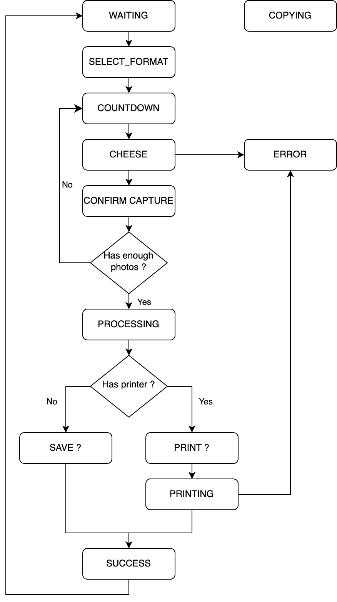
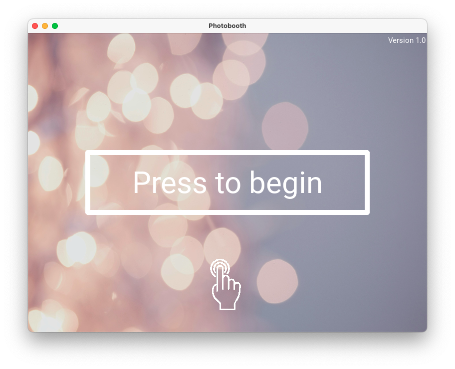
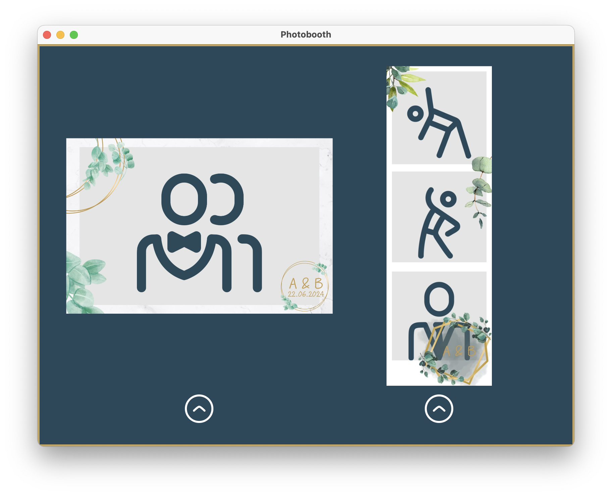
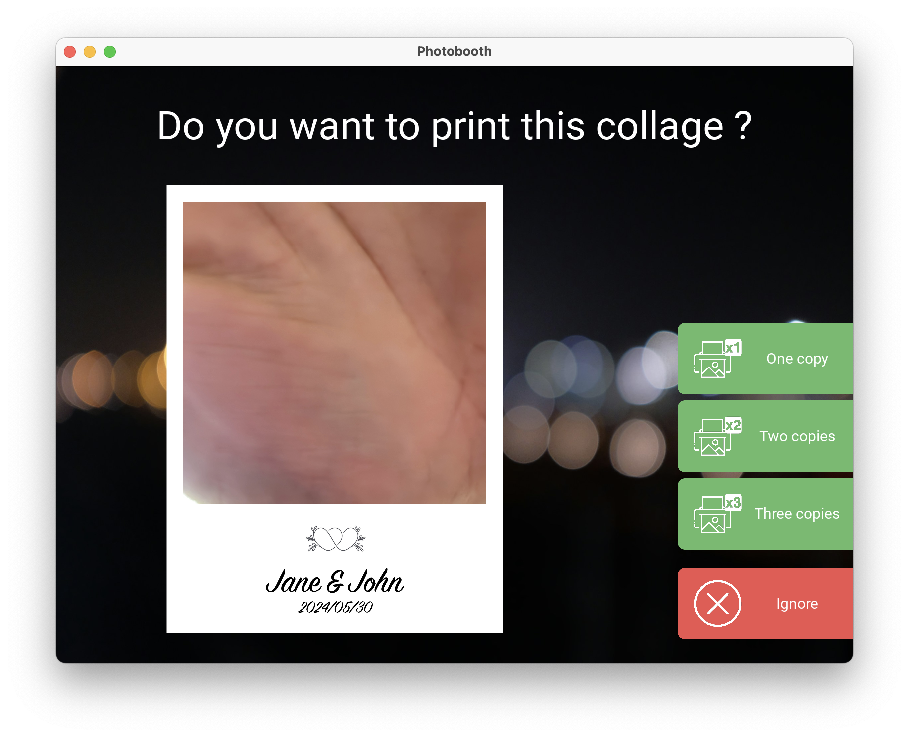

# Simple PhotoBooth

I wanted to create a very simple to use photobooth without unecessary features.
This project is easy to edit and has been tested on 3 to 5 years old child to ensure it was easy to understand the way to use it.

## State machine
It relies on a state machine to display screens.


## Screens




## Cameras
The application is compatible with [piCamera module 3](https://www.raspberrypi.com/products/camera-module-3/) (or [Arducam 64Mp B0399](https://www.arducam.com/product/64mp-af-for-raspberry-pi/)), DSLR and CV2 devices.
By default, it will try to use the best available quality:
 - If piCamera/Arducam is connected, it will be used for preview ;
 - If DSLR is connected, it will be used for capture ;

If one of these is not available, it will use the first available one.

## Compatibility
Tested on MacOs Sonoma and RaspberryPi 5 8GB with Pi Camera module 3.

## Materials
| Name | Link | Price |
|-------------|-------|
| TODO | TODO | 0.00  |
TODO

## Installation

### Global packages
```
# Install updates
sudo apt update

# Install dependencies
sudo apt-get install -y gcc make build-essential git scons swig
sudo apt install -y ffmpeg libturbojpeg0 python3-pip libgl1 libgphoto2-dev

#Install Python dependencies
pip3 install -r requirements.txt --break-system-packages
```

### Customize Pi and enable Kiosk mode
```
# Hide mouse
echo "autohide = true" >> .config/wf-panel-pi.ini
echo "autohide_duration = 500" >> .config/wf-panel-pi.ini
echo "layer = top" >> .config/wf-panel-pi.ini

# Hide taskbar
#sudo sed -i 's/^@lxpanel --profile LXDE-pi/#@lxpanel --profile LXDE-pi/' /etc/xdg/lxsession/LXDE-pi/autostart
sudo sed -i '/^[^#].*wfrespawn wf-panel-pi/ s/^/# /' /etc/wayfire/defaults.ini

# Disable power warning
echo "avoid_warnings=1" | sudo tee -a /boot/config.txt && sudo apt remove lxplug-ptbatt -y

# Disable media mount dialog
sudo sed -i -e 's/autorun=1/autorun=0/g' /etc/xdg/pcmanfm/LXDE-pi/pcmanfm.conf
sudo sed -i -e 's/autorun=1/autorun=0/g' /etc/xdg/pcmanfm/default/pcmanfm.conf

sudo reboot
```

### Install Ingcool 7" touchscreen (If it's the one you use)
```
sudo sh -c "echo '# Ingcool 7in touch screen' >> /boot/firmware/config.txt"
sudo sh -c "echo 'max_usb_current=1' >> /boot/firmware/config.txt"
sudo sh -c "echo 'hdmi_group=2' >> /boot/firmware/config.txt"
sudo sh -c "echo 'hdmi_mode=87' >> /boot/firmware/config.txt"
sudo sh -c "echo 'hdmi_cvt 1024 600 60 6 0 0 0' >> /boot/firmware/config.txt"
sudo sh -c "echo 'hdmi_drive=1' >> /boot/firmware/config.txt"
sudo sh -c "echo '' >> /boot/firmware/config.txt"
```

### Install Raspberry Camera Module V3 (Only if you plan to use one)

```
# Allocate more memory
sudo sed -i 's/^dtoverlay=vc4-kms-v3d/dtoverlay=vc4-kms-v3d,cma-512/' /boot/firmware/config.txt

# Reboot
sudo reboot

# Test
libcamera-still --list-camera
libcamera-still --autofocus-mode=auto -f -o test.jpg
```

### Install Arducam 64 B0399 (Only if you plan to use one)

```
# Install driver
./scripts/arducam_driver.sh

# Reboot
sudo reboot

# Test
libcamera-still --list-camera
libcamera-still --autofocus-mode=auto -f -o test.jpg
```

### Gphoto2 (Only if you plan to use a DSLR)
Gphoto2 should be fixed before use:
```
# Install required packages
wget https://raw.githubusercontent.com/gonzalo/gphoto2-updater/master/gphoto2-updater.sh
wget https://raw.githubusercontent.com/gonzalo/gphoto2-updater/master/.env
chmod +x gphoto2-updater.sh
sudo ./gphoto2-updater.sh -s
rm gphoto2-updater.sh .env

# Fix for USB not available
sudo chmod -x /usr/lib/gvfs/gvfs-gphoto2-volume-monitor
sudo chmod -x /usr/lib/gvfs/gvfsd-gphoto2

# Test
gphoto2 --capture-image
```

### CUPS printer (Only if you plan to print collages)
```
# Install CUPS
sudo apt-get install -y cups libcups2-dev python3-cups
sudo usermod -a -G lpadmin $USER
sudo cupsctl --remote-admin --remote-any

# Install Driverless printers
sudo apt install -y printer-driver-gutenprint

# Restart CUPS
sudo /etc/init.d/cups restart
```

Then go to `http://<raspberry-ip>:631/admin/`, declare a new printer and import `doc/DS620.ppd`.

### Led ring (Only if you plan to install one)
```
# Enable SPI on RaspberryPi
sudo sed -i 's/^#dtparam=spi=on/dtparam=spi=on/' /boot/firmware/config.txt

# Install Python dependency
pip3 install spidev --break-system-packages
```

Connect WS2812 Ring led on the following GPIO pins:
| WS2812 pins | Raspberry Pi pins              |
|-------------|--------------------------------|
| GND         | 6, 9, 14, 20, 25 (GND)         |
| DIN         | MOSI, Pin 19, GPIO 10          |
| VCC         | 5V. At least one of pin 2 or 4 |

### Autostart photobooth on boot
```
echo '[autostart]' >> ~/.config/wayfire.ini
echo 'photobooth = /home/pi/photobooth.sh' >> ~/.config/wayfire.ini
echo '#!/bin/bash' > /home/pi/photobooth.sh
echo 'cd /home/pi/photobooth/' >> /home/pi/photobooth.sh
echo 'python3 photoboothapp.py' >> /home/pi/photobooth.sh
chmod +x /home/pi/photobooth.sh
```

### Run
To start the application:
```
python3 photoboothapp.py
```

## Customization
To customize collages, you can edit `logo.png`. As a PNG file, you can use transparency.

You can also edit `photoboothapp.py` to change some parameters such as:
 - LOCALES = Locales.get_EN (To select language to use among EN and FR)
 - FULLSCREEN = False (If set to True, the window fill take all available space)
 - COUNTDOWN = 3 (Countdown before the photo is taken)
 - DCIM_DIRECTORY = './DCIM' (Directory in which the photos and collages are stored)
 - PRINTER = 'DS620' (The printer's name in CUPS)
 - HYBRID_ZOOM = None (To make the preview and captures devices match. Run `test/calibration_zoom.py` to find the correct tupple to apply (zoom, offset_x, offset_y))

## USB dump
A dedicated thread will handle USB dongles and automatically dump the whole content of the `DCIM_DIRECTORY` to the device.
Application will not be usable during the copy process but will display a message.

**USB dongle must be formated to FAT-32.**

## TODO
 - Test zoom
 - Buy pi camera module 3 for better quality ?
